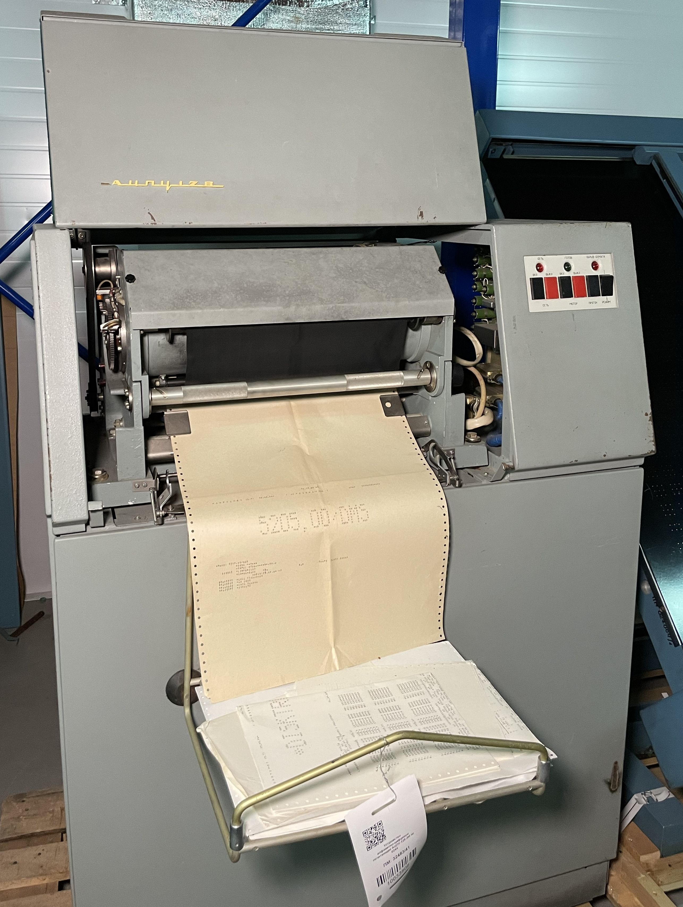
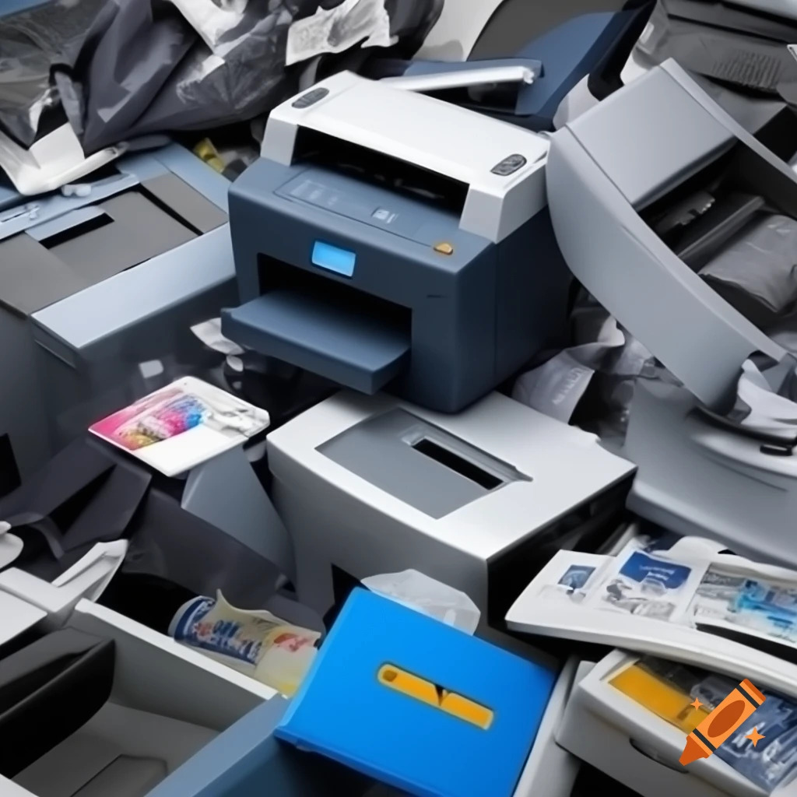
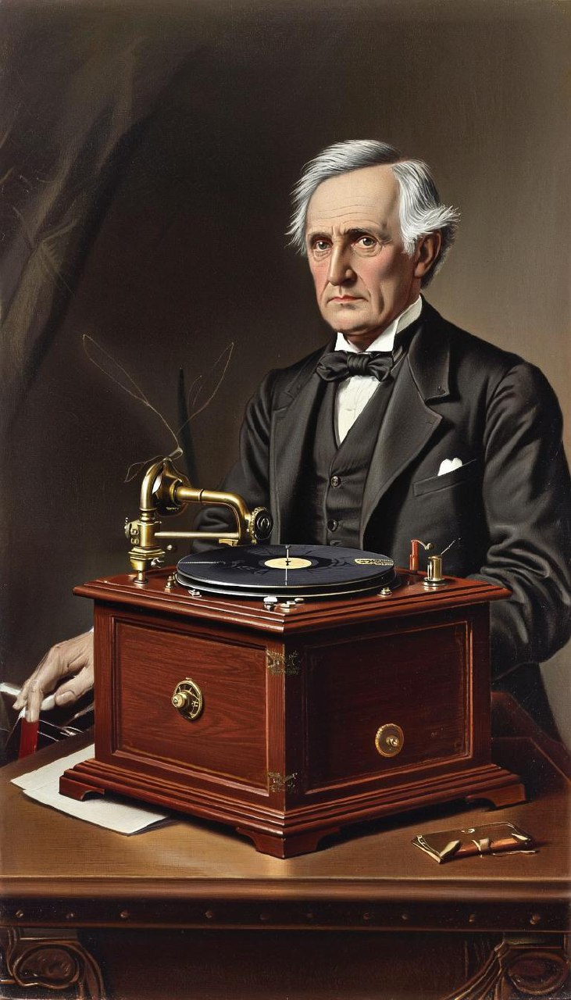
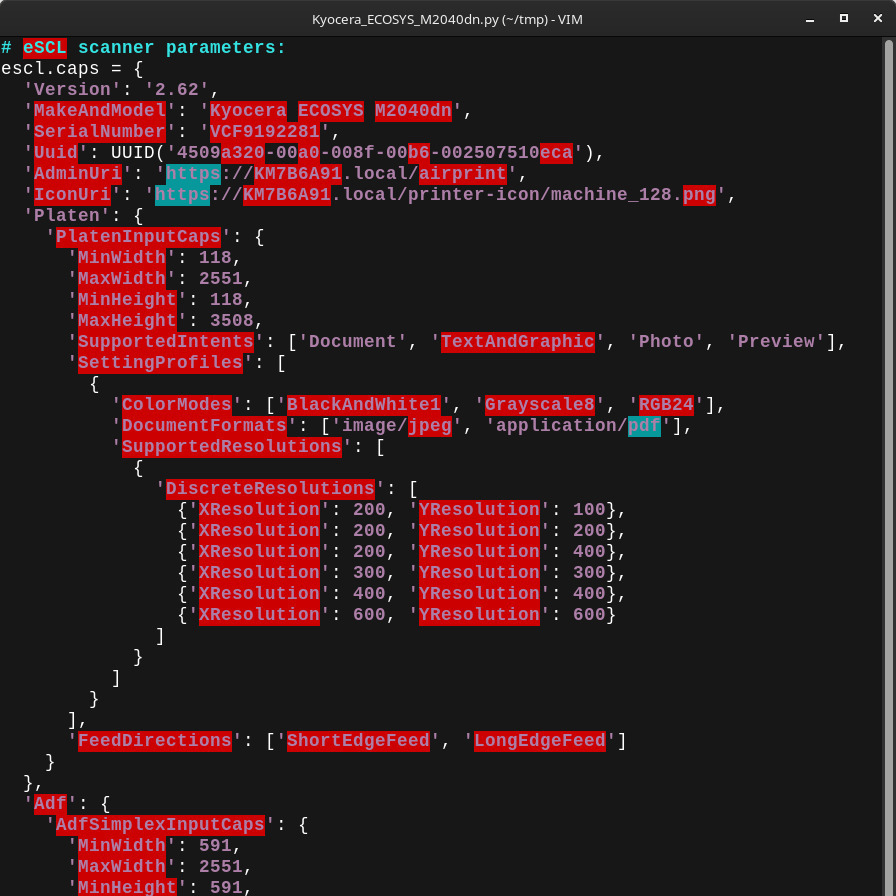
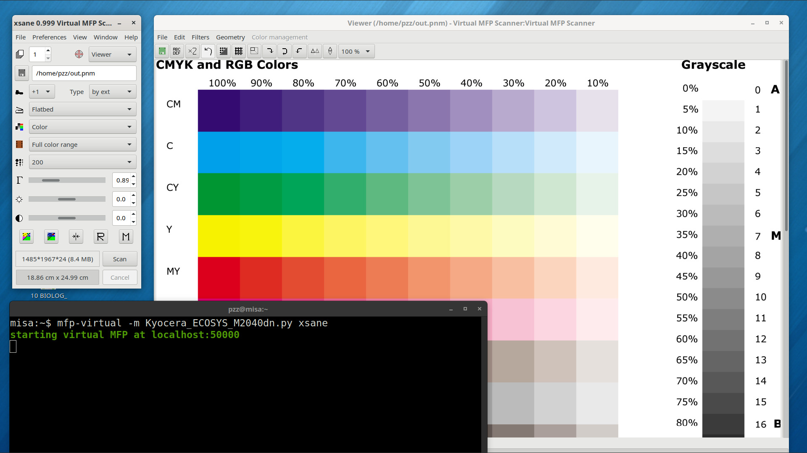
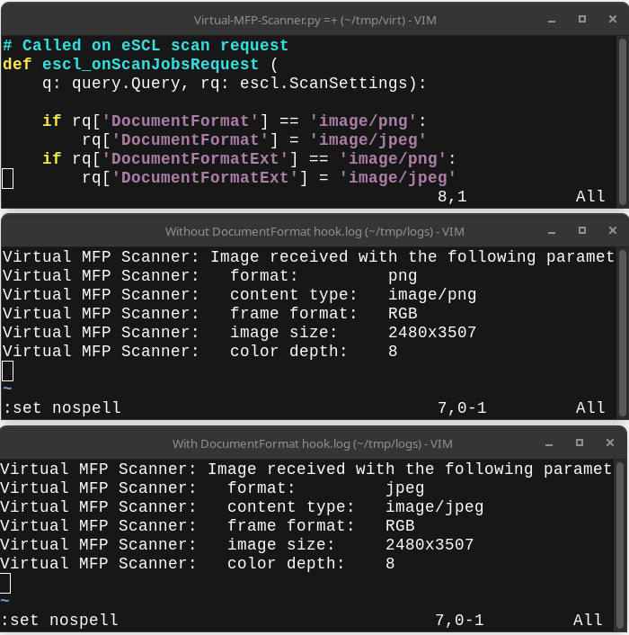
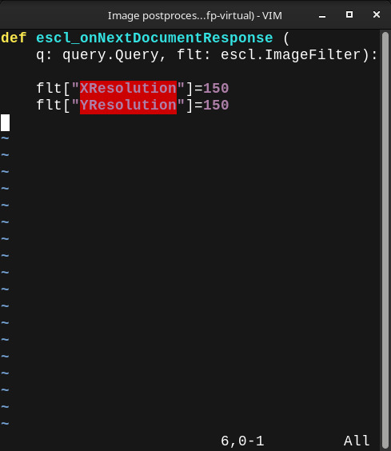
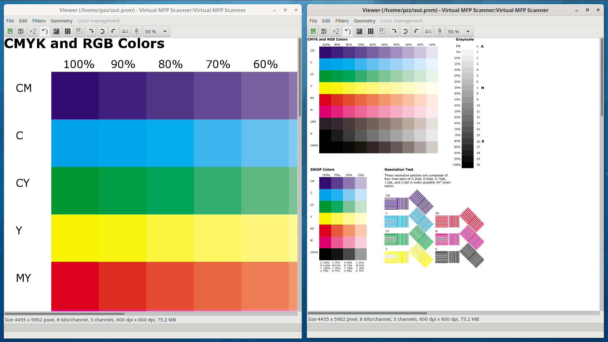

<!-- _header: '' -->
<!-- _footer: '' -->

# Behaviorally Accurate Simulator for Multifunction Printers and Scanners

 

## Alexander Pevzner (pzz@apevzner.com)

 
 
 

Image source and licensing information:
https://commons.wikimedia.org/wiki/File:BESM-6_ACPY.jpg

---
<!-- _header: '' -->
<!-- _footer: '' -->
# Alexander Pevzner

* OpenPrinting member since 2020
* Write systems software in C and Go
* Author of the [ipp-usb](https://github.com/OpenPrinting/ipp-usb) and
[sane-airscan](https://github.com/alexpevzner/sane-airscan) packages,
used everywhere
* [@alexpevzner](https://github.com/alexpevzner) at GitHub
* Now work with team that moves the entire 20-million city from
Windows to Linux
---

# Agenda

* Why we need MFP simulator?
* What is behaviorally accurate simulation?
* Scope of this project
* MFP is a complex thing. How to make models simple?
* Helper tools
* Side projects
* Current state
---

# Why We Need an MFP Simulator

* Printers are large, heavy, and expensive.
* Maintaining a representative collection is difficult, even for corporations.
* Printing and scanning software is complex.
* Development, troubleshooting, and support require reproducibility.
* Accurate simulation would be a solution.

---

# Scope of This Project

* Standard printing protocol (IPP).
* Standard scanning protocols (eSCL and WSD).
* IPP over USB simulation.
* DNS-SD and WS-Discovery advertising.
* Probably, semi-accurate implementation of legacy printing protocols,
  for completeness.
* Proprietary protocols not implemented and not planned.

---

# What is Behaviorally Accurate?

* For the standard protocols, behavior is defined by the specification
  and printer attributes/scanner capabilities.
* But this is not enough. Real hardware often deviate from these
  specifications.
* Model must define not only device parameters but the details of the
  actual device behavior.

---

# How accurate can be our models?

* The actual limiting factor is our detailed knowledge of the particular
  model.
* But 100% accuracy is not required. It is enough to reproduce essential
  details.
* In many cases it is enough just to reproduce the problem.

---
# Creation of models

* A model is a "recording" of a device's core capabilities — a simple
  collection of its printer attributes and scanner capabilities,
  made without behavioral details.
* The mfp-model tool records these baseline models automatically from
  real hardware.
* The mfp-virtual tool playbacks a model to emulate the original hardware.

---
# Live example

This is the fragment of the `Kyocera ECOSYS M2040dn` eSCL scanner,
automatically generated with the `mfp-model` tool.

---
<!-- _header: 'Behaviour-accurate MFP simulator -- Live Example' -->

---
# Adding behavior details

* Using auto-recorded model, we can reproduce the idealized MFP
  behavior: defined by model's parameters and implemented accurding
  to specifications.
* Now lets add some hardware-specific behavior details.

---
# The model language

* The model itself is a Python script.
* Printer attributes and scanner capabilities are defined as Python
  dictionaries.
* A set of Python hooks is provided to modify the model's behavior.
* All hooks are optional; write only the required ones.
* The simulator itself is written in Go but contains an embedded Python
  interpreter.

---
# The practical case

* One of the scanners I had to implement the workaround for
  offers the JPEG/PNG image support.
* `sane-airscan` always prefers PNG if available, because it is lossless.
* However, this device actually sends a JPEG, even when PNG is requested.
* This caused decode errors, forcing me to add automatic format detection to 
  `sane-airscan`.

---

* The `escl_onScanJobsRequest` hook in the model file can modify the eSCL scan request
  (represented as Python dictionary).
* We can see from the `sane-airscan` log that the received image format changed from PNG to JPEG.
* As simple as that; only few lines on Python required.

---
# Image filtering

* We also have image filtering pipeline, integrated into the simulator.
* Scanned image can be resampled to change resolution, cropped, color mode can be changed etc.
* This is useful to emulate firmware bugs and to test our drivers.

---
# Image filtering: try it

* `escl_onNextDocumentResponse` called when image is ready.
* It can set image post-processing parameters.
* We request image resampling from the original 600x600 to 150x150 DPI.
* As simple as that.
* Next slide shows it live.

---
<!-- _header: 'Behaviour-accurate MFP simulator -- Image filtering' -->

---
# Here's what we have

* A simulator core that provides an "ideal," fully standards-compliant base simulation of a printer or scanner.
* Model parameters that define the device in protocol-specific terms.
* Simple Python hooks that can modify any aspect of the device's behavior.
* Useful helper tool for models creation.
* This architecture makes our simulator both simple to use and powerful.

---
# Under the Hood

* The core simulator is a set of Go libraries that provide a generic and
  comprehensive implementation of several protocols (such as IPP, eSCL,
  WSD etc).
* Applications add a command-line interface (CLI) to access this functionality.
* This codebase can serve as a foundation for other projects, not necessarily limited to emulation

---
# The Proxy Mode

* Another useful component of this project is the `mfp-proxy`.
* It implements an IPP/eSCL/WSD proxy.
* Transit traffic can be captured (sniffed).
* Device models can be applied to the real, proxied devices, effectively modifying their characteristics or behavior.

---
# Current State

* This project is work in progress.
* Most Complete: eSCL scanner simulator.
* In Development: WSD scanner simulator (by Yogesh Singla, [yogesh1801](https://github.com/yogesh1801) at GitHub)
* Partially Done: IPP support.
* Proof-of-Concept: IPP-over-USB simulation (needs integration).
* Not Started: DNS-SD & WSD advertising.

---
# Side Projects

* This is a large project, with about 47K lines of Go code and 26K lines of tests.
* During development, several interesting sub-projects were created which may eventually have a life of their own.
* Here, I will briefly outline the most interesting of them.

---
# Go Avahi Bindings (cgo)

Complete, idiomatic Go bindings for the Avahi client library.
* As close to C API as possible.
* Idiomatic Go: Event handling via channels, not callbacks.
* Comprehensive documentation with many nuances. Useful even for C programmers.
* Moved into the separate project.

---
# Go Binding for CPython

Distinguishing features:
* Links against the generic libpython3.so, not a version-specific libpython3.NN.so.
* Uses only CPython stable API.
* Tolerant to minor Python version upgrades without requiring a rebuild.
* Automatic garbage collection of Python objects on the Go side.
* Currently part of main project (at the /cpython directory).

---
# That's All for Now

 
 
 

Thank you for your time and attention!

I'm happy to answer any questions.

 
 
 
 
 
 

---
# Contacts

 
 
 
 

Author can be easily reached using the Telegram messenger.

 
 
 
 

<!-- vim:ts=8:sw=4:et:textwidth=72
-->

